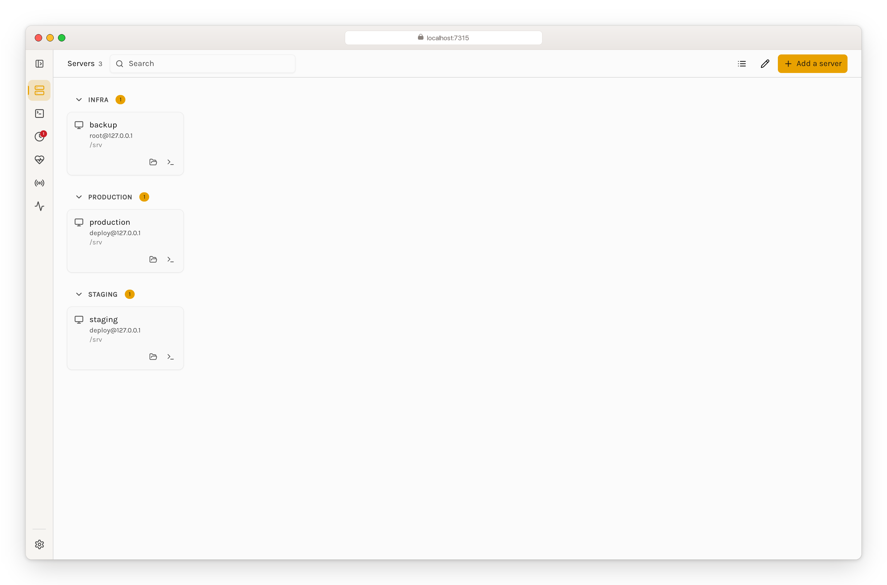
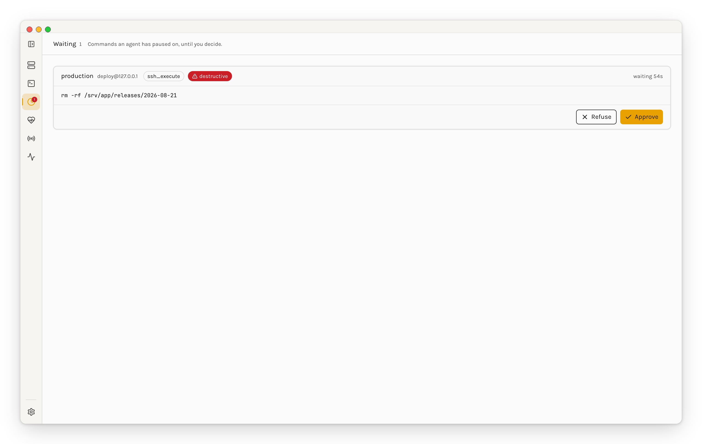
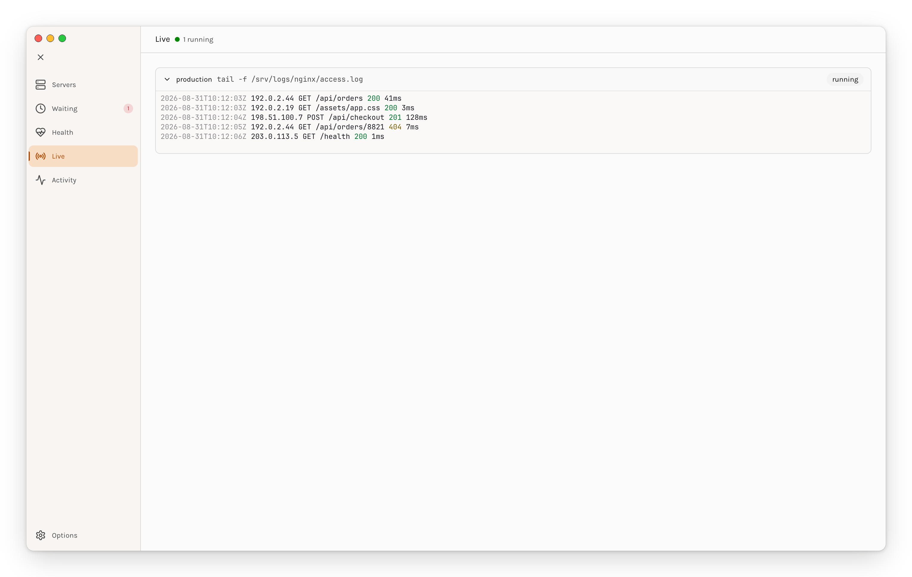
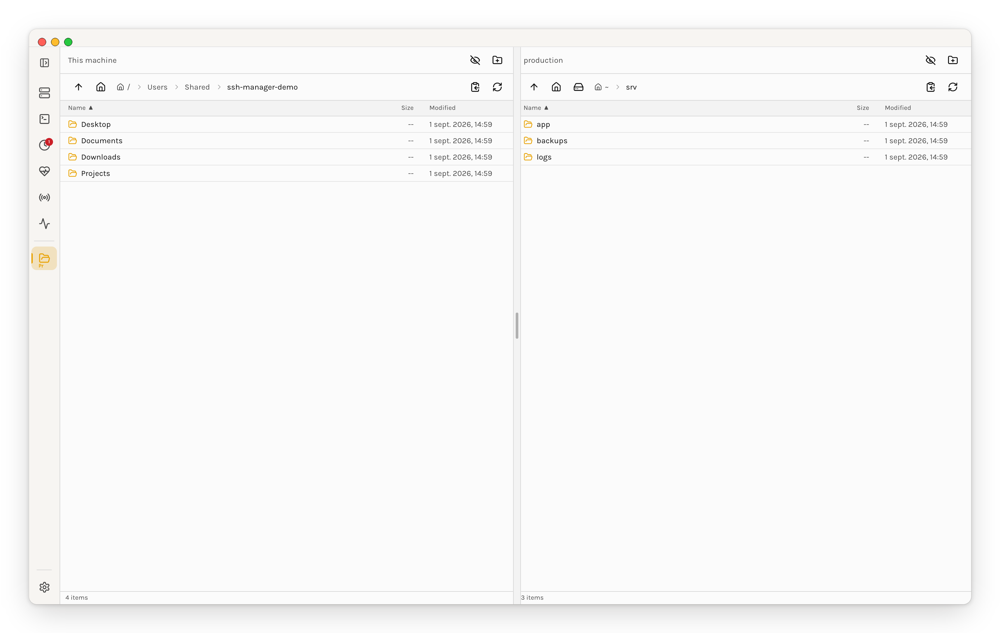
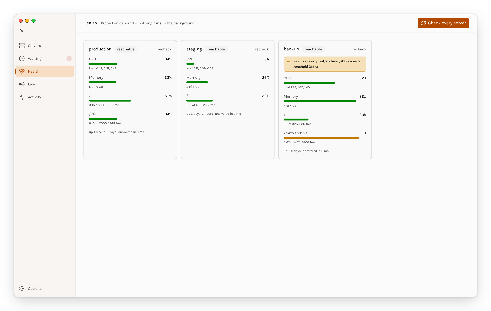
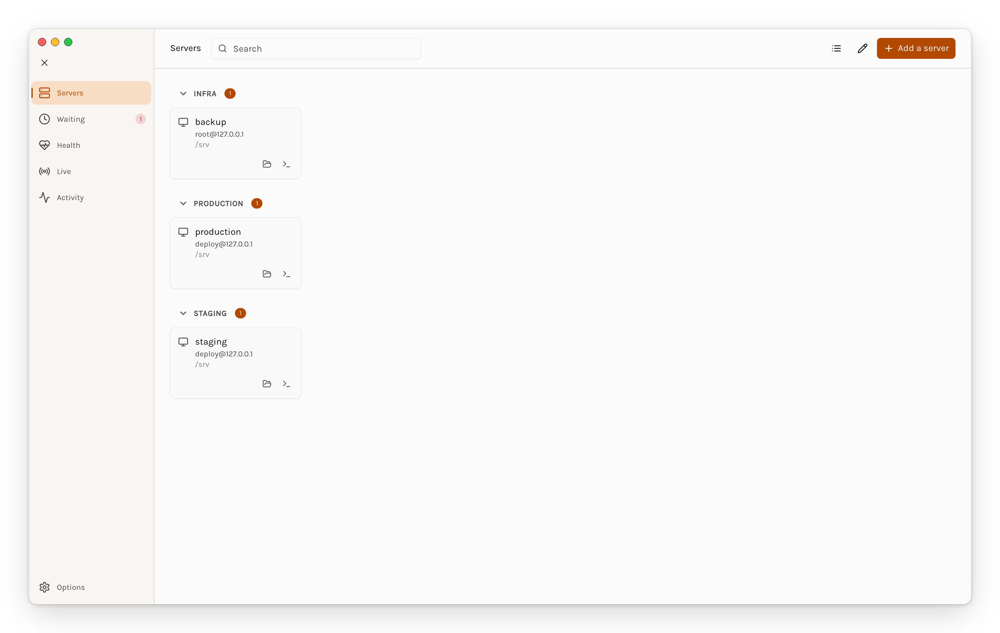

<p align="center">
  
</p>

<p align="center">
  <picture>
    <source media="(prefers-color-scheme: dark)" srcset="docs/images/wordmark-dark.png">
    
  </picture>
</p>

<h1 align="center">You give your agents a shell,<br>and you see what they do with it.</h1>

<p align="center">
  Let <b>Claude Code</b> and <b>OpenAI Codex</b> work on your real servers — run commands, move files,<br>
  query databases, take backups, check health — and watch over their shoulder while they do it.
</p>

<div align="center">

[](https://www.npmjs.com/package/mcp-ssh-manager)
[](https://www.npmjs.com/package/mcp-ssh-manager)
[](https://github.com/bvisible/mcp-ssh-manager/releases/tag/v4.0.0)
[](https://claude.ai/code)
[](https://openai.com/codex)
[](https://modelcontextprotocol.io)
[](https://scorecard.dev/viewer/?uri=github.com/bvisible/mcp-ssh-manager)
[](LICENSE)

</div>

<p align="center">
  <picture>
    <source media="(prefers-color-scheme: dark)" srcset="docs/images/control-plane-dark.gif">
    
  </picture>
</p>

<p align="center">
  <sub>Twenty seconds, unedited — <a href="docs/videos/control-plane.mp4">watch full size</a>. Real SSH, real SFTP, three throwaway hosts on the loopback.</sub>
</p>

---

## The problem, in one line

An MCP SSH server is the most dangerous tool you can hand an agent: a shell on machines that matter. Today, when your agent runs something on production, you find out afterwards — if you find out at all.

**This one lets you watch, and lets you say no.** It is also, on the boring days, simply a very good way to let an assistant do the server work you were going to do yourself.

---

## Up and running in a minute

```bash
npm install -g mcp-ssh-manager     # or: brew tap bvisible/mcp-ssh-manager https://github.com/bvisible/mcp-ssh-manager && brew install ssh-manager

ssh-manager server add             # guided: host, user, key or password
claude mcp add ssh-manager mcp-ssh-manager
```

That's it. Restart Claude Code and ask it something.

<details>
<summary>Using Codex, a source checkout, or a project-scoped install?</summary>

<br>

**OpenAI Codex** — same install, then two files. In `~/.codex/config.toml`:

```toml
[mcp_servers.ssh-manager]
command = "mcp-ssh-manager"
env = { SSH_CONFIG_PATH = "/Users/you/.codex/ssh-config.toml" }
startup_timeout_ms = 20000
```

And your servers in `~/.codex/ssh-config.toml`:

```toml
[ssh_servers.production]
host = "prod.example.com"
user = "admin"
key_path = "~/.ssh/id_rsa"
default_dir = "/var/www"
group = "production"
```

Everything below works identically from Codex — same 37 tools, same config fields.

**From source:**

```bash
git clone https://github.com/bvisible/mcp-ssh-manager.git
cd mcp-ssh-manager && npm install
cd cli && ./install.sh
claude mcp add ssh-manager node /absolute/path/to/mcp-ssh-manager/src/index.js
```

**Scopes** — `--scope project` writes an `.mcp.json` your team can commit; `--scope user` enables it everywhere for you.

**Prerequisites** — Node 18+, on Linux, macOS or Windows. `rsync` for `ssh_sync`, `sshpass` only if you sync with password auth (`brew install hudochenkov/sshpass/sshpass`, or `apt-get install sshpass`).

</details>

---

## Then just ask

No syntax to learn. Your assistant already knows how to use the 37 tools; you talk to it in your own words.

| You say | What happens |
|---|---|
| *"Why is production slow right now?"* | CPU, memory, disk, load average and the top processes, in one round trip |
| *"Back up the database before I deploy."* | A compressed, timestamped MySQL/PostgreSQL/MongoDB dump with a retention policy |
| *"Tail the nginx error log on staging."* | Live output, streamed as it happens |
| *"Push ./dist to production:/var/www and restart nginx."* | The files out, then the restart — with ownership, permissions and a rollback copy handled |
| *"Which of my servers is running out of disk?"* | Every server in the group, checked in parallel |
| *"Open a tunnel to the production database."* | Local port forward, so your GUI client just connects |
| *"Run `docker ps` on everything tagged production."* | One command, the whole group, sequential or parallel |

<p align="center">
  
</p>

<p align="center">
  <sub>There is a CLI too, for when you'd rather do it yourself: <code>ssh-manager</code> with no arguments opens this.</sub>
</p>

---

## Watch over its shoulder — the control plane

> **On the `v4` branch, not released yet.** All of it is opt-in: with no vault, no `APPROVAL` setting and nothing running, the engine behaves exactly as it does today.

```bash
ssh-manager control          # prints a local URL — or open the desktop app
```

One thing in two wrappers. `ssh-manager control` runs the whole interface in a browser tab with nothing extra to install; the desktop builds for macOS, Windows and Linux are that same page with the engine inside them, so they need neither Node nor the npm package.

The desktop build adds the two things a browser tab cannot do:

- **It lives in the menu bar.** The icon carries a count when something is waiting, and its menu lists what is blocked on you, which shells and commands are open right now, and your servers — so "is anything waiting on me?" costs a glance instead of a window switch. Closing the window leaves it there rather than quitting.
- **It posts real system notifications**, with the application's own identity, so macOS and Windows show and route them properly. Destructive requests stay on screen instead of fading after four seconds. macOS asks your permission the first time it needs to.

<p align="center">
  
</p>

### Stop it before it runs

<p align="center">
  
</p>

The agent pauses and waits. You see the machine, the user, the tool, and the command **in full** — wrapped, never truncated, because half a command is how you approve the wrong thing. A desktop notification fires when something is waiting, because the request that goes unseen is the one that times out and is denied.

Approval is switched on **from the interface, per server** — not from a file:

```
Servers → the server → Approval → never (default) | destructive | always
```

It is deliberately the one setting you cannot put in a `.env`. It exists to make
an agent stop and wait for you, and a switch sitting in a plain-text file next to
the code is a switch the agent can flip on its own: one `sed -i` and the gate is
gone. It lives in the encrypted vault, and the control plane is the only thing
that writes it. If you had `SSH_SERVER_*_APPROVAL` set in a file, the engine says
so on every start rather than quietly leaving you unprotected.

The `destructive` list is deliberately short. A prompt that cries wolf gets clicked through without being read, which is worse than no prompt at all: `systemctl restart` does not interrupt you, `systemctl stop` does.

Every failure denies — timeout, unreachable socket, a control plane that hangs up mid-review. The one exception is *approval configured but nothing listening*: that allows and says so loudly in the audit log, because failing shut would break every agent the moment you close the window.

### See what it's doing, while it does it

<p align="center">
  
</p>

Output goes through a terminal emulator, not a `<pre>` tag — what your agent ran looks exactly like what you'd have seen had you typed it yourself, colours and all. Each stream keeps a bounded scrollback, so opening the screen mid-command shows what came before instead of starting blank.

**Nothing here touches the disk.** A stream can carry secrets — a config being catted, a token echoed by a deploy script — so it lives in memory, capped, and disappears with the window.

### Both filesystems, side by side

<p align="center">
  
</p>

Drag a file across and it moves directly between your machine and the server through the control plane. The browser never holds the bytes — which is faster, and the only way a multi-gigabyte file works at all.

### Health, when you ask for it

<p align="center">
  
</p>

**Nothing is probed in the background.** Each check is an SSH handshake, and a dashboard that connects to every production box on a timer is worse than no dashboard. The button is the whole scheduling policy. Thresholds are yours to set, and crossing one is said in words rather than encoded in a colour.

### And the rest of it

<p align="center">
  
</p>

On the same page: an interactive shell on any server, saved commands you pick from a list instead of retyping, groups you can run one command across, the audit trail of what agents ran and what you decided, and your known host keys.

Every screenshot above is the desktop build; each has a browser twin in [`docs/images/`](docs/images/). See [ROADMAP-V4.md](ROADMAP-V4.md) for what is built and what isn't.

---

## Safe by default

Other SSH MCP servers hand the agent a shell and wish you luck. This one assumes you'd like some say in the matter.

### Decide how far it can go — per server

| Mode | What the agent can do |
|---|---|
| `unrestricted` *(default)* | Everything. Same as any other SSH MCP server, zero overhead. |
| `readonly` | Mutating tools are refused outright — no deploy, no upload, no sudo, no database import. Reads still work. |
| `restricted` | Every command must match an allow pattern **and** no deny pattern. Anything else is refused before it reaches the host. |

```env
SSH_SERVER_PROD_MODE=readonly
SSH_SERVER_STAGING_MODE=restricted
SSH_SERVER_STAGING_ALLOW_PATTERNS=^systemctl (status|restart) myapp$;^tail -n \d+ /var/log/
SSH_SERVER_PROD_AUDIT_LOG=~/.ssh-manager/audit.jsonl
```

This is a second layer under Claude Code's `autoApprove`, which is all-or-nothing per tool: once `ssh_execute` is approved, anything goes. Useful when you're sharing the MCP with a third-party agent, a CI bot, or working on a client's machine. Full reference in **[docs/SECURITY_MODES.md](docs/SECURITY_MODES.md)**.

### Credentials out of the clear-text `.env`

```bash
ssh-manager vault import      # take what you already have, encrypted
ssh-manager vault list        # see it, without ever printing a secret
ssh-manager vault add prod    # add one interactively
ssh-manager vault backup FILE # a copy that survives a new machine
```

AES-256-GCM, master key in your OS keychain (a `0600` file where there is none — Windows, CI, containers). Only secret *values* are encrypted: hosts, users and modes stay readable, so the file can still be inspected and diffed. GCM is authenticated, so a tampered vault fails loudly instead of handing a wrong password to a production server.

**The key belongs to this machine.** A vault copied to a new laptop is ciphertext nobody can open — `vault backup` writes a copy encrypted under a passphrase you choose, which is what makes the move survivable. Your `.env` is never modified, not by `import`, not by the interface, and a setup half in each is a normal state rather than a broken one. Upgrading changes nothing on its own: see **[docs/MIGRATION.md](docs/MIGRATION.md)**.

### The unglamorous parts, which are the ones that bite

- **Your sudo password never reaches the remote command line.** It travels on the SSH channel's stdin, so it isn't visible in `ps`, in `/proc/<pid>/cmdline`, or in an `auditd` trail — unlike the `echo "$pass" | sudo -S` pattern common in this category ([#34](https://github.com/bvisible/mcp-ssh-manager/issues/34)).
- **Every shell argument is quoted** through one central helper, with a test that drives **340 builder × argument × payload combinations** through a real shell to prove none of them execute.
- **Read-only SQL is enforced, not suggested.** `ssh_db_query` refuses anything that isn't a `SELECT`.
- **Vulnerabilities are published, not buried.** [SECURITY.md](SECURITY.md) has the reporting process and every advisory already fixed — including the three in v3.8.5, one of which defeated `readonly` mode.
- **Reproducible installs.** The lockfile is committed, CI installs with `npm ci`, and a test enforces that every dependency resolves to registry.npmjs.org with an integrity hash and no unreviewed install scripts.

---

## Reference

<details>
<summary><b>All 37 tools</b></summary>

<br>

**Core** — always enabled

| Tool | What it does |
|---|---|
| `ssh_list_servers` | Every configured server, with its group and mode |
| `ssh_execute` | Run a command. Falls back to the server's `DEFAULT_DIR` when no `cwd` is given |
| `ssh_upload` / `ssh_download` | Move a single file either way |
| `ssh_sync` | Bidirectional rsync, with real transfer counts |

**Backup & restore** (v2.1+)

| Tool | What it does |
|---|---|
| `ssh_backup_create` | MySQL, PostgreSQL, MongoDB or files — compressed, with metadata and retention |
| `ssh_backup_list` | Everything available, with size, date and retention |
| `ssh_backup_restore` | Restore one, including across databases |
| `ssh_backup_schedule` | Put it on cron, with automatic cleanup |

See the [Backup Guide](docs/BACKUP_GUIDE.md) and [examples/backup-workflow.md](examples/backup-workflow.md).

**Health & monitoring** (v2.2+)

| Tool | What it does |
|---|---|
| `ssh_health_check` | CPU, memory, disk, network, uptime, load — with an overall verdict |
| `ssh_service_status` | nginx, mysql, docker… on systemd or sysv |
| `ssh_process_manager` | List, inspect or kill; sort by CPU or memory |
| `ssh_alert_setup` | Thresholds, and what happens when one is crossed |
| `ssh_monitor`, `ssh_tail` | Live resource monitoring and log following |

**Databases** (v2.3+)

| Tool | What it does |
|---|---|
| `ssh_db_dump` | MySQL, PostgreSQL, MongoDB; optional gzip, optional table subset |
| `ssh_db_import` | Import a dump, `.gz` handled automatically |
| `ssh_db_list` | Databases, or the tables inside one |
| `ssh_db_query` | **`SELECT` only** — enforced, not suggested |

**Deployment & sessions**

| Tool | What it does |
|---|---|
| `ssh_deploy` | Files out, with permissions, backup and restart handled — see the [Deployment Guide](docs/DEPLOYMENT_GUIDE.md) |
| `ssh_execute_sudo` | Sudo, with the password on stdin rather than the command line |
| `ssh_session_*` | Persistent shells that keep their context between commands |
| `ssh_tunnel_*` | Local, remote and SOCKS forwarding |

**Organisation**

| Tool | What it does |
|---|---|
| `ssh_alias` | Short names for servers |
| `ssh_command_alias` | Short names for commands you keep retyping |
| `ssh_group_*`, `ssh_execute_group` | Run one thing across many machines |
| `ssh_hooks` | Automation hooks around SSH operations — see [Aliases and Hooks](docs/ALIASES_AND_HOOKS.md) |
| `ssh_profile` | Swap whole sets of aliases and hooks — `default`, `frappe`, `docker`, `nodejs`, or your own |

</details>

<details>
<summary><b>Spending less context — tool groups</b></summary>

<br>

All 37 tools cost roughly **43.5k tokens** of context. Most people don't need all of them.

```bash
ssh-manager tools configure     # interactive wizard
ssh-manager tools list          # what's on right now
ssh-manager tools enable monitoring
ssh-manager tools disable backup
```

| Mode | Tools | Context | Good for |
|---|---|---|---|
| **All** *(default)* | 37 | ~43.5k | The full set |
| **Minimal** | 5 | ~3.5k | Just SSH, and 92% of the context back |
| **Custom** | 5–37 | varies | Whatever you actually use |

Groups: **core** (5, always on) · **sessions** (4) · **monitoring** (6) · **backup** (4) · **database** (4) · **advanced** (14).

Fewer tools also means fewer approval prompts and a faster start. `ssh-manager tools export-claude` writes the matching auto-approval block.

📖 [Complete guide →](docs/TOOL_MANAGEMENT.md)

</details>

<details>
<summary><b>Configuration — every field</b></summary>

<br>

Two interchangeable formats, read by the same loader: `.env` is the usual choice with Claude Code, TOML with Codex (from `SSH_CONFIG_PATH`, or `~/.codex/ssh-config.toml`). Both can coexist — the loader merges them.

```env
SSH_SERVER_[NAME]_HOST=hostname_or_ip
SSH_SERVER_[NAME]_USER=username
SSH_SERVER_[NAME]_PASSWORD=password          # or use a key
SSH_SERVER_[NAME]_KEYPATH=~/.ssh/key
SSH_SERVER_[NAME]_PASSPHRASE=key_passphrase  # optional
SSH_SERVER_[NAME]_PORT=22                    # optional
SSH_SERVER_[NAME]_DEFAULT_DIR=/var/www       # optional working directory
SSH_SERVER_[NAME]_SUDO_PASSWORD=…            # optional, for automated deploys
SSH_SERVER_[NAME]_DESCRIPTION=…              # optional
SSH_SERVER_[NAME]_GROUP=production           # optional, free-form label
SSH_SERVER_[NAME]_PLATFORM=windows           # optional: linux (default) | windows
SSH_SERVER_[NAME]_PROXYJUMP=bastion          # optional: another server, as jump host
SSH_SERVER_[NAME]_PROXYCOMMAND=…             # optional: ncat, ssh -W, …
SSH_SERVER_[NAME]_FORWARD_AGENT=true         # optional, and a real security trade-off
SSH_SERVER_[NAME]_MODE=readonly              # optional: unrestricted | readonly | restricted
# Approval is NOT a field here — it is set per server from the control plane and
# stored in the vault, so that a shell on one of your machines cannot switch off
# the gate that exists to stop it.
SSH_SERVER_[NAME]_AUDIT_LOG=~/audit.jsonl    # optional JSONL trail
```

The same thing in TOML:

```toml
[ssh_servers.production]
host = "prod.example.com"
user = "admin"
key_path = "~/.ssh/id_rsa"
port = 22
default_dir = "/var/www"
group = "production"
description = "Production server"

[ssh_servers.winhost]
host = "192.168.1.90"
user = "svc-ssh"
key_path = "~/.ssh/winhost_key"
port = 2222
platform = "windows"

[ssh_servers.internal]
host = "10.0.0.5"
user = "admin"
proxy_jump = "bastion"
```

**Loading order**, highest priority first: process environment → `.env` → the encrypted vault → TOML. A credential you deliberately put in the vault beats one left in a `.env`; an operator overriding for a single run still beats both.

**Profiles** bundle aliases and hooks per project type. Set one with `export SSH_MANAGER_PROFILE=frappe`, or write the name into a `.ssh-manager-profile` file. Ships with `default`, `frappe`, `docker` and `nodejs`; add your own in `profiles/`.

More examples: [examples/codex-ssh-config.example.toml](examples/codex-ssh-config.example.toml).

</details>

<details>
<summary><b>Getting to machines you can't reach directly</b></summary>

<br>

**Through a bastion** — the tunnel is transparent, every tool works as usual:

```env
SSH_SERVER_BASTION_HOST=bastion.example.com
SSH_SERVER_BASTION_USER=jumpuser
SSH_SERVER_BASTION_KEYPATH=~/.ssh/bastion_key

SSH_SERVER_PRIVATE_HOST=10.0.0.5
SSH_SERVER_PRIVATE_USER=admin
SSH_SERVER_PRIVATE_PROXYJUMP=bastion
```

Chains work: if `bastion` itself has a `PROXYJUMP`, it's followed recursively. Circular references are detected and rejected.

**Through a SOCKS proxy or a custom command** — it runs locally and forwards to the host, with `%h` and `%p` for host and port:

```env
SSH_SERVER_SOCKS_PROXYCOMMAND="ncat --proxy 127.0.0.1:1080 --proxy-type socks5 %h %p"
SSH_SERVER_WINPROXY_PROXYCOMMAND="C:\Windows\System32\OpenSSH\ssh.exe -W %h:%p user@jump-host"
```

**Passphrase-protected keys** — load the key into `ssh-agent` and nothing else is needed; `SSH_AUTH_SOCK` is picked up automatically, the same mechanism plain `ssh` uses. Storing `PASSPHRASE` in the config works too, and is the less good option.

**Agent forwarding** (`FORWARD_AGENT=true`, off by default, per server) lets a process on the remote host authenticate to *other* hosts with your local keys — `git clone` over SSH on a server without copying a private key there.

> ⚠️ Anyone who can read the forwarded socket on that host — **root included** — can impersonate you against other hosts for the life of the connection. Only for servers you trust, exactly as `ssh_config(5)` advises.

**Groups** — tag servers and they become a group, with no extra file to maintain:

```env
SSH_SERVER_WEB1_GROUP=production
SSH_SERVER_WEB2_GROUP=production
```

Groups created with `ssh_group_manage` live in `.server-groups.json` and additionally carry execution settings (strategy, delay, stop-on-error). When a name exists in both places, **membership is the union** and the stored settings apply. Names are case-insensitive. A group that exists only through the `group` field is read-only for `ssh_group_manage` — change membership by editing the servers.

</details>

<details>
<summary><b>When something goes wrong</b></summary>

<br>

**Claude Code freezes or shows "Interrupted"** — almost always an output too large for the context. Output is auto-truncated and the default timeout is two minutes, but you can tune it:

```env
MCP_SSH_MAX_OUTPUT_LENGTH=5000    # default 10000 characters
MCP_SSH_DEFAULT_TIMEOUT=180000    # default 120000 ms
MCP_SSH_COMPACT_JSON=true         # fewer tokens per response
```

And prefer `tail -n 100 huge.log` over `cat huge.log` — the same advice you'd give a colleague.

**Tools don't show up** — `claude mcp list`, then restart Claude Code. `/mcp` inside Claude Code shows the live status.

**Connection failed** — `ssh-manager server test <name>` first; it tells you whether it's DNS, the firewall, or the credentials.

**Permission denied** — check `chmod 600 ~/.ssh/your_key`, then the username, then what that user is allowed to do on the host.

Still stuck? [Open an issue](https://github.com/bvisible/mcp-ssh-manager/issues) — include the server's `PLATFORM` and what `ssh-manager server test` said.

**Known limitations, honestly:**

- **Command timeouts are advisory.** ssh2 can't kill a remote process; on Linux and macOS hosts a `timeout` wrapper does it properly. On Windows hosts set `PLATFORM=windows` to skip that wrapper, which OpenSSH for Windows doesn't understand.
- **`ssh_sync` with password auth needs `sshpass`.** Keys are better anyway. On a Windows host, pass native paths like `local:C:\project` — drive-letter and UNC paths are converted to MSYS2 form, and a path already written as `/c/...` is passed through untouched rather than converted twice.
- **Connections are pooled and reused.** A stale one reconnects on next use; force it with `ssh_connection_status` and the `reconnect` action.

</details>

<details>
<summary><b>Working on the project</b></summary>

<br>

```bash
git clone https://github.com/bvisible/mcp-ssh-manager.git
cd mcp-ssh-manager && npm ci
./scripts/setup-hooks.sh      # pre-commit checks, including secret detection

npm test                      # 33 suites
npm run typecheck             # JSDoc through tsc, no build step
npm run test:all              # both, plus ./scripts/validate.sh
```

The layout:

```
src/          index.js is the MCP server and its 37 tools; one module per domain
              (ssh-manager, config-loader, session-manager, backup-manager,
               health-monitor, database-manager, tunnel-manager, server-groups…)
cli/          the Bash CLI, plus the Node wrapper that makes it work on Windows
ui/           the control plane's React interface (v4)
desktop/      the Electron build (v4)
profiles/     frappe, docker, nodejs — and room for yours
scripts/      validation, and the rig that regenerates every screenshot and the video
docs/         guides, migration notes, security modes
```

Pull requests are welcome — [CONTRIBUTING.md](CONTRIBUTING.md) has the details.

Nothing in this README's imagery is taken by hand. `scripts/demo-env.mjs` stands up three real ssh2 servers on the loopback with a seeded vault, a pending approval and a live stream; `capture-screenshots.mjs` and `record-demo.mjs` drive Chrome over the DevTools protocol against it; `frame-screenshots.py` draws the browser and application windows, and `macbook-mockup.py` draws the laptop. After a UI change, re-run them rather than editing an image.

The hero animation ships twice, light and dark, swapped by `<picture>` on `prefers-color-scheme`. A single transparent GIF would have been simpler, but GIF alpha is one bit and transparency defeats its inter-frame compression: the same clip came out at **11.4 MB** transparent against 357 KB on a solid ground.

</details>

---

## What's new

**v3.8.5 — a security release.** Three command-injection advisories fixed, one of which defeated `readonly` mode. Upgrade if you use `ssh_backup_*`, `ssh_db_dump`, `ssh_service_status` or `ssh_tail`.

- **RCE bypassing `readonly` / `restricted`** ([GHSA-m793-whw6-f537](https://github.com/bvisible/mcp-ssh-manager/security/advisories/GHSA-m793-whw6-f537)) — `ssh_service_status` and `ssh_tail` are read-only, so they stay enabled on servers you locked down, and neither quoted its arguments nor consulted the policy layer. A service name like `nginx; id > /tmp/pwned` executed.
- **RCE through `ssh_db_dump`** ([GHSA-796j-h5q5-jx6p](https://github.com/bvisible/mcp-ssh-manager/security/advisories/GHSA-796j-h5q5-jx6p)) — the `stat` run after the dump interpolated the output path raw. The v3.6.7 patch had stopped one line short.
- **RCE through every `ssh_backup_*` tool** ([GHSA-qwwm-vrm9-4mw8](https://github.com/bvisible/mcp-ssh-manager/security/advisories/GHSA-qwwm-vrm9-4mw8)) — `backup-manager.js` had zero shell escaping across its nine builders while `database-manager.js` had 95.

Quoting now lives in one module so "did this builder quote its inputs?" has a single answer.

[Full changelog, every release back to v1.0.0 →](CHANGELOG.md)

---

<div align="center">

**[Documentation](docs/)** · **[Changelog](CHANGELOG.md)** · **[Security policy](SECURITY.md)** · **[Roadmap](ROADMAP-V4.md)** · **[Issues](https://github.com/bvisible/mcp-ssh-manager/issues)**

<br>

Built on the [Model Context Protocol](https://modelcontextprotocol.io), with [ssh2](https://github.com/mscdex/ssh2) doing the hard part.
MIT licensed — see [LICENSE](LICENSE).

<br>

Made with ❤️ for the Claude Code community

<br><br>

<a href="https://glama.ai/mcp/servers/@bvisible/mcp-ssh-manager">
  
</a>

[](https://mcptoplist.com/server/glama%2Fbvisible%2Fmcp-ssh-manager)

</div>
